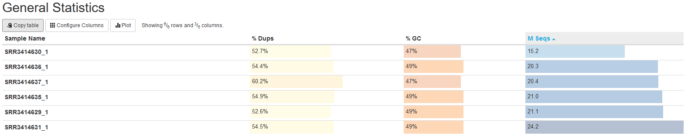
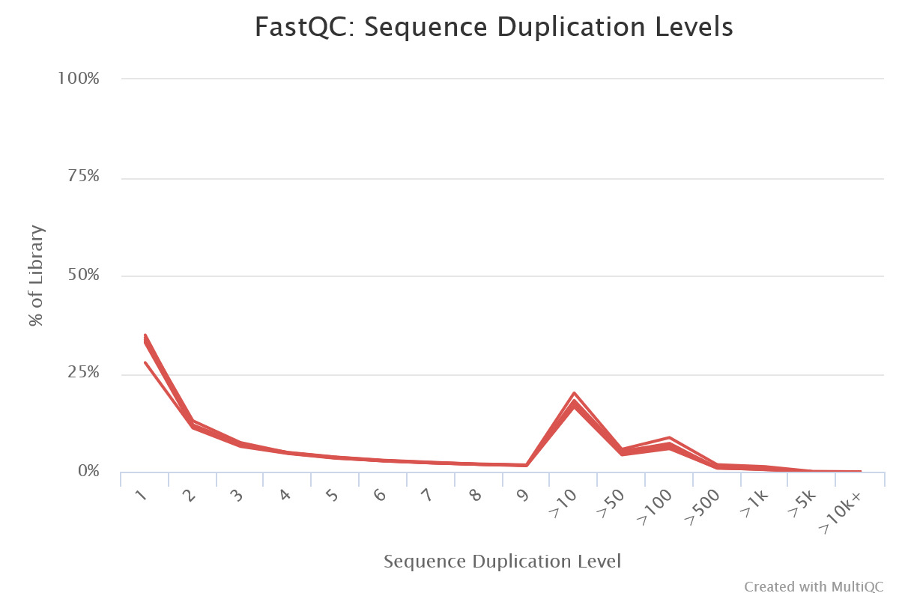
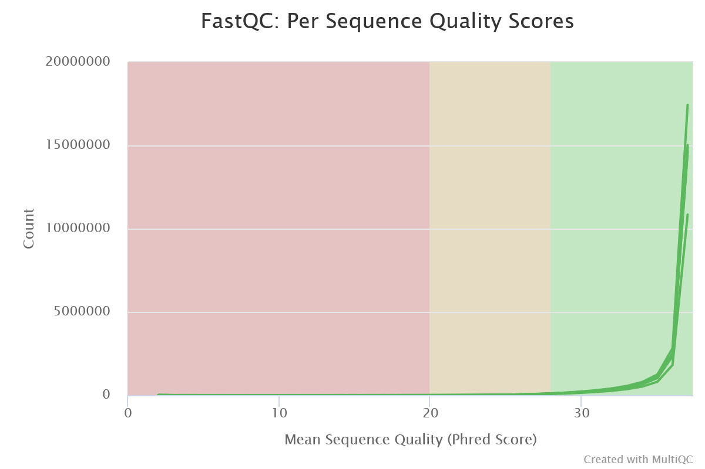
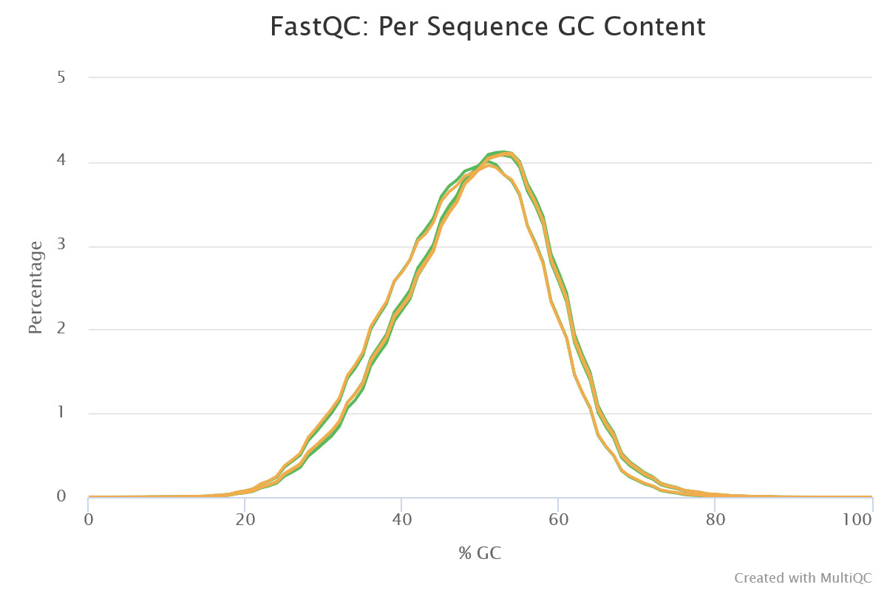
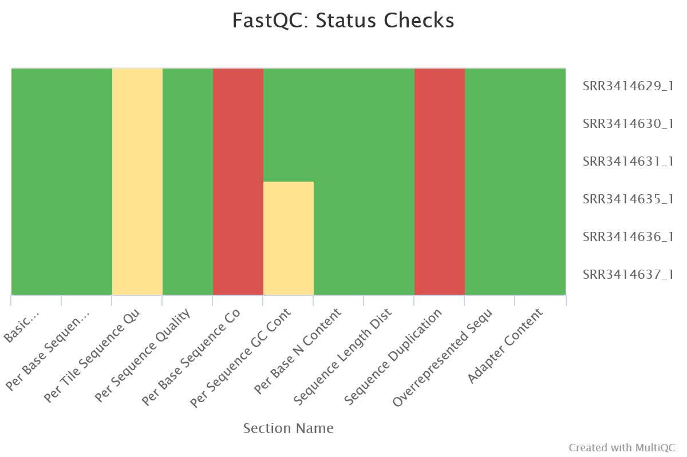

# Differential RNA-seq analysis (bioinformatics minor homework)
## Part 1: data preparation
### [Google Colab link](https://colab.research.google.com/drive/1DpefwmIcyMZxgygA8Q5n1hlqYW_jLwOi?usp=sharing)
### MultiQC report

### Genome mapping results
Sample ID | type | total reads | total mapped reads | unique mapped reads | reads mapped on genes |
 --- |--- |--- |--- |--- | ---
SRR3414635 | control	| 20 956 475	| 20 395 865 (97.3%) |	18 428 317 (87.9%) |	16 275 997 (77.7%)
SRR3414636 | control |	20 307 147 |	19 757 059 (97.3%) |	17 825 380 (87.8%) |	15 757 580 (77.6%)
SRR3414637 | control	| 20 385 570	| 19 847 291 (97.4%) |	17 844 858 (87.5%) |	15 736 978 (77.2%)
SRR3414629 |	reprogramming |	21 106 089 |	20 510 113 (97.2%) |	18 375 888 (87.0%) |	16 049 609 (76.0%)
SRR3414630 |	reprogramming |	15 244 711 |	14 832 680 (97.3%) |	13 186 139 (86.5%) |	11 465 324 (75.2%)
SRR3414631 |	reprogramming |	24 244 069 |	23 547 686 (97.1%) |	20 928 945 (86.3%) | 18 408 851 (75.9%)

## Part 2: data analysis
### [Google Colab link](https://colab.research.google.com/drive/1QBZR9WWVBPjnA-QbLUwogyv0QVEWE3xM?usp=sharing)
